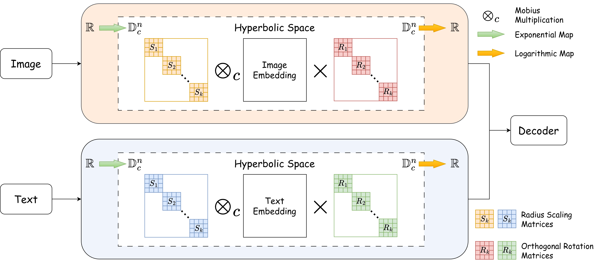

# Semantic Alignment in Hyperbolic Space for Open-Vocabulary Semantic Segmentation
This is our official implementation of HyRo!

[[Project](https://tmhoanggg.github.io/HyRo/)] [[Colab](https://colab.research.google.com/drive/1nb3YD5LHDO5d27KSnJFoI52dJ0-tt6rn?usp=sharing)]


## Overview
<p align="center">
  
</p>

We introduce HyRo, a framework extending the hyperbolic radius adjustment from [HyperCLIP](https://github.com/SJTU-DeepVisionLab/HyperCLIP) by adding a hyperbolic rotation module, based on the hypothesis that semantic alignment may be mismatched after radius adjustment.


## Installation

Please follow [installation](INSTALL.md). 

## Data Preparation

Please follow [dataset preperation](datasets/README.md), or download the complete dataset from this [Kaggle Dataset](https://www.kaggle.com/datasets/tmhoang/open-vocabulary-semantic-segmentation).

## Demo

You can download the model weights, install the required dependencies, and run the demo using the following command:
```bash
python demo/demo.py --config-file configs/vitb_384_hyperbolic.yaml --input path/to/input --output path/to/output --opts MODEL.WEIGHTS path/to/weights
```
Alternatively, you can run the demo directly in [Google Colab](https://colab.research.google.com/drive/1nb3YD5LHDO5d27KSnJFoI52dJ0-tt6rn?usp=sharing).


## Training
We provide shell scripts for training and evaluation. ```run.sh``` trains the model in default configuration and evaluates the model after training. 

To train or evaluate the model in different environments, modify the given shell script and config files accordingly.

### Training script
```bash
sh run.sh [CONFIG] [NUM_GPUS] [OUTPUT_DIR] [OPTS]

# For ViT-B variant
sh run.sh configs/vitb_384.yaml 4 output/
# For ViT-L variant
sh run.sh configs/vitl_336.yaml 4 output/
```

## Evaluation
```eval.sh``` automatically evaluates the model following our evaluation protocol, with weights in the output directory if not specified.
To individually run the model in different datasets, please refer to the commands in ```eval.sh```.

### Evaluation script
```bash
sh run.sh [CONFIG] [NUM_GPUS] [OUTPUT_DIR] [OPTS]

sh eval.sh configs/vitb_384_hyperbolic.yaml 4 output/ MODEL.WEIGHTS path/to/weights.pth
```


## Training and Evaluation

You can launch the entire training and evaluation pipeline using:

```bash
bash run_train_test.sh
```

## Pretrained Models
We provide pretrained weights for our models reported in the paper. All of the models were evaluated with 8 NVIDIA A100 GPUs, and can be reproduced with the evaluation script above.

<table><tbody>
<!-- START TABLE -->
<!-- TABLE HEADER -->
<th valign="bottom">Model</th>
<th valign="bottom">CLIP</th>
<th valign="bottom">A-847</th>
<th valign="bottom">PC-459</th>
<th valign="bottom">A-150</th>
<th valign="bottom">PC-59</th>
<th valign="bottom">PAS-20</th>
<th valign="bottom">PAS-20b</th>
<th valign="bottom">Download</th>
<!-- TABLE BODY -->
<!-- ROW: HyRo (B) -->
<tr>
<td align="left">HyRo (B)</a></td>
<td align="center">ViT-B/16</td>
<td align="center">12.0</td>
<td align="center">18.9</td>
<td align="center">31.2</td>
<td align="center">57.3</td>
<td align="center">95.0</td>
<td align="center">76.7</td>
<td align="center"><a href="https://huggingface.co/tmhoanggg/HyRo/resolve/main/model_base.pth">ckpt</a>&nbsp;
</tr>

</tbody></table>

## Acknowledgement
Thanks to the excellent works and their codebases of [CAT-Seg](https://github.com/cvlab-kaist/CAT-Seg) and [HyperCLIP](https://github.com/SJTU-DeepVisionLab/HyperCLIP). 